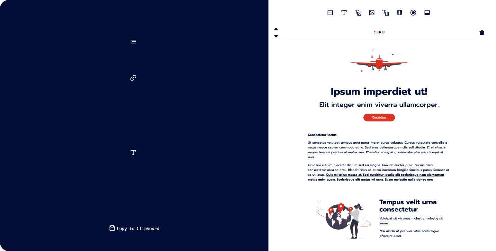

# E-mail Editor

### *Description*

This repository contains a simple frontend web application for creating newsletter e-mails using prefabricated HTML
sections. This editor's intended use is within a FileMaker WebViewer element for full save/edit functionality.

### *Contents*

* `legacy/`: deprecated editor contents.
    * `components/`: `HTML` code for subcomponents of the editor view.
    * `quill/`: locally installed code for _**[Quill JS](https://quilljs.com)**_.
    * `scripts/`: deprecated scripts.
    * `stylesheets/`: deprecated stylesheets.
        * `components/`: component stylesheets.
        * `email.scss`: stylesheets for the e-mail being constructed _(designed specifically
          for **[YERO International Education](https://www.ye-ro.com)**_).
    * `index.html`: deprecated editor `HTML`.
    * `script.js`: deprecated editor `JavaScript` file.
    * `style.scss`: editor stylesheet.
* `novel/`: editor code.
    * `scripts/`: final editor scripts.
        * `editorHandler.js`: script for handling the functions of the editor panel.
        * `emailEditor.js`: unified script for all editor functionalities.
        * `previewHandler.js`: script for handling the e-mail preview.
        * `sectionHandler.js`: script for handling section editing and editor interface.
    * `stylesheets/`: final editor stylesheets.
        * `email.scss`: stylesheet for the e-mail being constructed _(updated version of `
          legacy/stylesheets/email.scss)_.
        * `style.scss`: stylesheet for the editor.
    * `index.html`: editor `HTML`.
* `.gitignore`
* `editor.json`: editor parameter containing e-mail style, header, and section `HTML`s.
* `email.txt`: test file for passing an existing e-mail for editing instead of a blank starter.
* `index.html`: editor `HTML` with style and scripts embedded.

### *How to Use*

This editor's intended use is within a WebViewer object of FileMaker, however, it can be used in a browser. The
disadvantage of browser use over FileMaker is that there exists no backend to maintain already created e-mails and edit
them later.

There exists **8** section types which can be used in your e-mail.

1. Header
2. Text
3. Text & Image
4. Image
5. Text & Video
6. Video
7. Button
8. Footer

Sections are added by clicking on their respective icons at the top of the preview (right half of the page). Once a
section is added, it can be selected by clicking, at which point there will appear arrow and trash icons. Arrows let the
user move the section up or down the e-mail, and the trash icon deletes the section.

Once a section is selected, its contents can be edited in the editor (left half of the page).

#### Editor

Each section has predetermined editable properties. Double-column sections (i.e. Text & Image and Text & Video) have an
editable Alignment property. They can be aligned as the text section being on the left, right, and below the
image/video.

The also exists a URL property. In sections that contain images, the URL property acts as the source URL of the image
being displayed. In sections with videos, the URL accepts the YouTube link of the video, from which the thumbnail is
automatically taken and used as a clickable image. For the Button section the URL property specifies the button link,
and for the Footer section the link specifies the e-mail being displayed on the footer, which recipients can reply to.